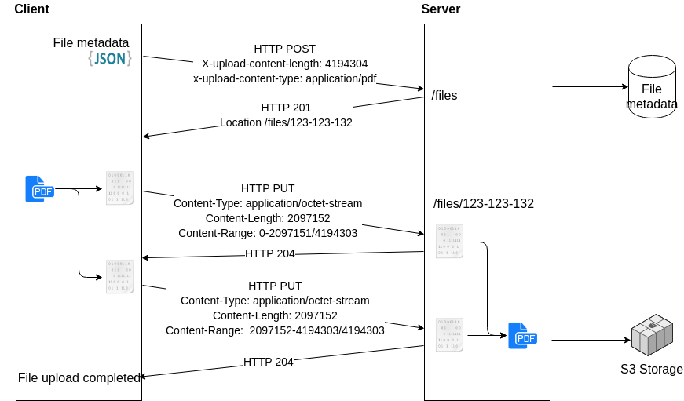

# Upload van files
Dit document is een technische richtlijn en beschrijft hoe toekomstige services file uploads  moeten implementeren op een RESTful manier. 
In dit document is een onderscheid gemaakt tussen twee types van files. Files  kleiner dan 2 mb en files van 2 mb tot 1 GB. Files groter dan 1 GB zijn voorlopig buiten scope. 
## Upload in 1 stap (as-is)
Momenteel worden files in veel applicaties (digitale kluis, DAMs,...) geüpload in 1 single call. De file zit of base64 encoded of als multipart in de payload met metadata die verzonden wordt. Dit heeft een aantal voor- en nadelen:
**Voordelen:**
-- Simpel: Metadata en binaire base 64 encoded payload worden samen verzonden
-- Makkelijke te implementeren door developer
**Nadelen:**
-- Grotere files hebben een zwaardere impact op de API (volledig in memory laden, geen file specifieke data, …)
-- Geen streaming functionaliteiten
-- Herstarten van een grotere upload is niet mogelijk
-- Base64 encoding en decoding van file vergroot ook de file size
-- Limitatie op grootte van file (webservers leggen limieten op body size)

## Upload in 2 stappen
Een ander scenario is het opsplitsen van de variabele metadata en de binaire payload. Eerst wordt er een plaats gereserveerd met de metadata. Na deze reservatie wordt de locatie waar de file naar kan worden geüpload, teruggegeven. Vervolgens kan men de binarie payload uploaden naar deze locatie.
Deze methode heeft volgende voor- en nadelen:
**Voordelen:**
-- Herstarten van een upload is mogelijk
-- Metadata en binaire data zijn van elkaar gescheiden
-- Er kunnen verschillende manieren van file uploads geïmplementeerd worden. (werken met referrals, uploaden via binary payload, multipart,…). Hierdoor kunnen er ook grotere files verzonden worden.
**Nadelen:**
-- Metadata kan mogelijks nooit aan een file gekoppeld worden  => cleanup mechanismen voorzien	
-- Implementatie is complexer

## 2-step upload
Beide methodes hebben hun voor- en nadelen, maar om “future proof” te zijn en om de deur open te houden voor het uploaden van grotere files (mb’s en gb’s) zullen files voortaan altijd geüpload worden d.m.v. de 2 step upload.

### Stap 1: Uploaden metadata
Eerste stap is het uploaden van de metadata.
Men zal binnen de applicatie een reservatie maken met metadata als payload. In de HTTP headers moeten volgende headers worden meegegeven:
-- X-upload-content-length: size van de file in bytes
-- X-Upload-Content-Type: content type van de file

Bv:
```
HTTP Post https://dummy.supertoffe.api/fileupload/v1/files
Content-Type: application/json
Content-length: 289
X-upload-content-length: 1097356
X-Upload-Content-Type: application/pdf
{
	"archived": false,
	"archivedAt": "2018-01-19T10:39:29.157Z",
	"metadata": [
	{
		"value": "string",
		"key": "string"
	}],
	"userStatus": "string",
	"lockStatus": "string",
	"destination": "string",
	"id": 0,
	"archivedMapId": 0,
	"lockMotivation": "string",
	"tags": [
		"String"
	]
}
```

De response zal bij een correcte reservatie een HTTP 201 zijn met een Location header. Hiermee kan men dan de file uploaden. De manier hoe, is afhankelijk van de grootte van de file en wordt  in de volgende 2 hoofdstukken verder besproken.

### Stap 2: Upload binaire files kleiner dan 2mb
Files kleiner dan 2mb kunnen door de meeste application servers met standaard configuratie in een keer ontvangen (max body size). Omdat de oplossing voor grotere files complexer is, is er hier een onderscheid gemaakt. Wanneer er files kleiner dan 2 mb worden geüpload, wordt onderstaande methode als voorkeur gezien. 
Dit betekent niet dat er hier een verplichting is deze methode te gebruiken,  de upload methode beschreven in volgend hoofdstuk kan ook voor kleinere files worden gebruikt.

Overzicht:
 
Dit kan met een binary payload:
```
PUT /fileupload/v1/files/eeda85ea-a653-44f4-b10d-026f42100107
Content-Type: application/pdf
Content-Length: 1097152
%....
1 0 obj
<<
/Type /Catalog
0000001690 00000 n
0000002423 00000 n
0000002456 00000 n
0000002574 00000 n
Startxref
2714
%%EOF
```
Of door middel van een multipart/form-data upload.
```
PUT /fileupload/v1/files/eeda85ea-a653-44f4-b10d-026f42100107 HTTP/1.1
Content-Type: multipart/form-data; boundary=--------------------------173622278589357014105329
content-length:1097356
Connection: keep-alive
----------------------------173622278589357014105329
Content-Disposition: form-data; name="file"; filename="sample.pdf"
Content-Type: application/pdf
%PDF-1.3
%....
1 0 obj
<<
/Type /Catalog
0000001690 00000 n
0000002423 00000 n
0000002456 00000 n
0000002574 00000 n
Startxref
2714
%%EOF
----------------------------173622278589357014105329--
```
### Stap 2: Upload binaire files groter dan 2mb
Alle application servers hebben limitaties op body size van een payload. Om deze limitaties te omzeilen wordt gebruik gemaakt van HTTP file streaming waarbij de file wordt opgesplitst in blokken van maximum 2 mb. Omdat we binnen deze standaard gebruik maken van headers die multipart/form-data zelf probeert op te vullen, is het niet mogelijk om files in multipart/form-data te uploaden. Alleen binaire payload application/octet-stream uploads zijn toegelaten. Files uploaden met multipart/form-data is niet toegelaten.
Na het terugkrijgen van de location URL waar de file naar kan worden geüpload, kunnen volgende parameters worden toegevoegd aan de headers van de request.
Headers:
-- Content-Length: Grootte van het stukje dat we nu gaan uploaden
-- Content-Range: First byte-last byte/total length of file
-- Content-Type: application/octet-stream
Overzicht:
 
Bv:
Een upload van een file van 4mb zal dus in 2 stukken worden geüpload:

Part 1
```
PUT /fileupload/v1/files/eeda85ea-a653-44f4-b10d-026f42100107
Content-Length: 2097152
Content-Range: 0-2097151/4194303
Content-Type: application/octet-stream
Payload: bytes 0-2097151
```
Part 2
```
PUT /fileupload/v1/files/eeda85ea-a653-44f4-b10d-026f42100107
Content-Length: 2097152
Content-Range: 2097152-4194303/4194303
Content-Type: application/octet-stream
Payload: bytes 2097152-4194303
```
Aan de hand van de x-upload-content-length en content-type die doorgestuurd is, kan de server nu de file terug samenstellen en opslaan in het correcte formaat.
###Overzicht
Methods | Kleiner dan 2 MB | Groter dan 2MB
------------- | ------------- | --------------
Multipart/form-data  | X | 
Binary HTTP payload | X | 
HTTP Streaming |  | X

## Referenties
Dropbox upload streaming: https://blogs.dropbox.com/tech/2014/07/streaming-file-synchronization/
Google Drive API: https://developers.google.com/drive/v3/web/multipart-upload 
YouTube resumable upload API: https://developers.google.com/youtube/v3/guides/using_resumable_upload_protocol 
OneDrive large file upload: https://docs.microsoft.com/en-us/onedrive/developer/rest-api/api/driveitem_createuploadsession
Http Range Requests: https://tools.ietf.org/html/rfc7233 
Multipart: https://www.ietf.org/rfc/rfc2388.txt


